# P-NET-RTT

> 此存储库是对开源 P-Net 评估版本在 RT-Thread 上的移植，用于 Profinet 设备实现的 P-Net 协议栈。

## 1.前期准备

软件环境

* [CODESYS](https://us.store.codesys.com/)（profinet主站模拟）
  * CODESYS
  * CODESYS Gateway（网关设备）
  * CODESYS Control Win SysTray（软PLC设备）
* [Npcap](https://npcap.com/dist/npcap-1.80.exe)（该软件是运行CODESYS必须的，需要提前安装好！）
* [PRONETA](https://support.industry.siemens.com/cs/attachments/67460624/proneta_3_8_0_0.zip)

硬件环境

* 附带ETH的微控制器（eth驱动需支持 RT-Thread 以太网驱动框架）

## 2.软件包配置

打开 bsp 下的 env界面，进入 **->RT-Thread online packages->IoT**，找到 **[*] P-Net stack for Profinet device implementation  --->** 使能，同时留出配置提供给用户：

```md
-*- Default netif name for P-NET  --->
	-> (e00) default ethernet interface name for p-net app, default as 'e00
-*- Enable P-NET sample board config  --->
	-> (0x0209) p-ent user led pin
	-> (0x0005) p-net user key pin
-*- Default root filesystem path for P-NET  --->
    -> [*] p-net using ramfs filesystem by default, or you can turn this off and choose another way to enable the filesystem
    -> (8192)  default memory size for ramfs
-*- P-NET sample slave network ip config  --->
    -> (192.168.10.100) set static ip address for profinet slaver
    -> (192.168.10.1) set static gateway address for profinet slaver
    -> (255.255.255.0) set static mask address for profinet slaver
    version (latest)  --->
```

* **Default netif name for p-net**：p-net 网卡设备接口名称，默认为 e00 ；
* **Enable pnet sample board config**：p-net app 用户LED及按键配置；
* **Default root filesystem path for p-net**：p-net 文件系统配置，默认使用 ramfs ，默认分配 8K 内存空间；
* **P-NET sample slave network ip config**：p-net 从站设备静态IP配置（**请关闭 RT_LWIP_DHCP 功能，使用静态IP**）

下面我们还需要配置禁用dhcp功能并使用静态IP，进入 **→ RT-Thread Components → Network → LwIP: light weight TCP/stack**，选择禁用DHCP；


完成上述配置后，将程序编译下载至开发板。

## 3.网络配置

我们使用一根网线连接开发板与PC，同时在PC端配置静态IP：


检查开发板端的 IP 信息，并测试联通性：


## 4.软PLC主站启动

> CODESYS简介：CODESYS是德国3S公司开发的PLC软件，集成了PLC逻辑、运动控制、组态显示等功能。CODESYS，全称为“Controller Development System”，是一种基于 IEC 61131-3 标准的工业自动化编程工具。它不仅支持多种编程语言（如梯形图、结构化文本、功能块图等），还提供了丰富的库和功能模块，帮助工程师快速开发和调试 PLC（可编程逻辑控制器）和工业控制系统。CODESYS 的灵活性和强大功能使其成为工业自动化领域广泛使用的开发平台。

### 4.1 CODESYS创建标准工程

请确保已安装CODESYS软件，安装之后下面这三个是我们需要用到的软件：


* CODESYS V3.5 SP20 Patch 3：Profinet 主站模拟
* CODESYS Gateway V3：网关设备
* CODESYS Control Win V3 -x64 SysTray：软PLC设备

首先打开 **CODESYS V3.5 SP20 Patch 3**，依次选择 -> 新建工程 -> Projects -> Standard project ，配置工程名称及位置后点击确定：

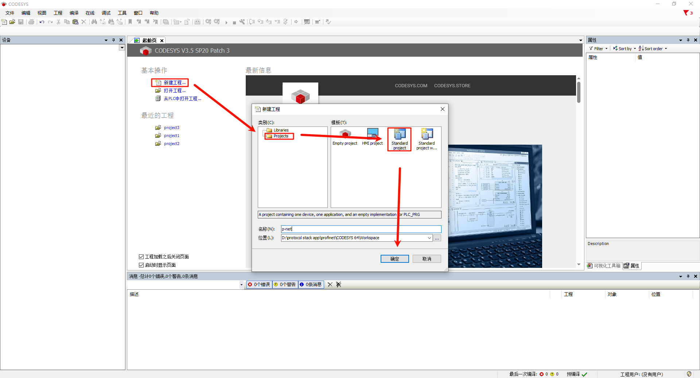

弹出下面这个弹窗后保持默认配置(CODESYS Control Win V3 (CODESYS) / x64 (CODESYS))点击确定：

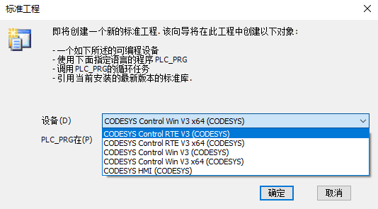

> 注意：如果您购买了**[CODESYS Control RTE SL](http://store.codesys.cn/codesys/store/detail.html?productId=58)**，可选择设备：CODESYS Control RTE V3 (CODESYS) / x64 (CODESYS)，正常评估用途可选择不安装此扩展包，选择 CODESYS Control Win V3 (CODESYS) / x64 (CODESYS) 设备创建即可。

创建成功后就可以看到主界面了：


### 4.2 Gateway 及 软PLC 启动

依次打开下面两个软件：

* CODESYS Gateway V3（右键 Start Gateway）
* CODESYS Control Win V3 -x64 SysTray（右键 Start PLC）


回到 CODESYS 主站软件，双击 Device(CODESYS Control Win V3 x64) -> 通信设置 -> 扫描网络

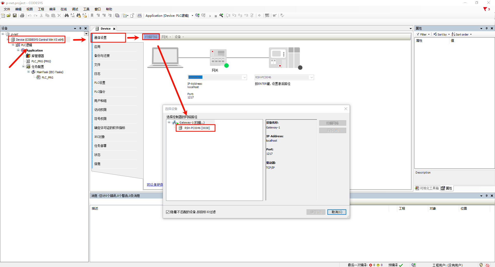

 弹出设备用户登录窗口后，配置用户名和密码（用户自定义）：


检查网关设备及软PLC设备是否在线：

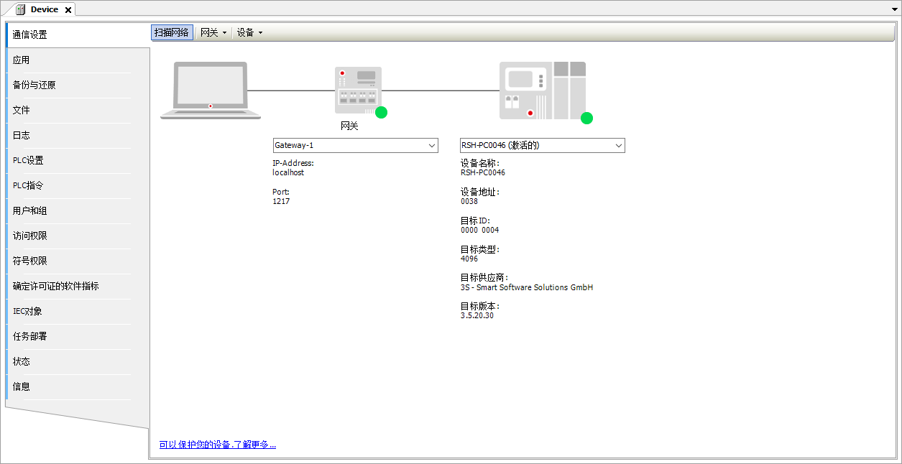

### 4.3 profinet GSDML文件添加

> GSD(Generic Station Description file)：即通用站点描述文件，主要用于PROFIBUS DP（GSD文件）和PROFINET IO（GSDML文件）通信，作为描述文件，是PLC系统中CPU模块和IO模块之间的桥梁，通常包括通道数据、参数数据、诊断数据以及用户自定义数据。

本项目的 GSDML文件位于如下路径：

* ..\src\ports\rtthread\pn_dev

选择设备存储库安装描述文件，选择上述路径下的 **GSDML-V2.4-RT-Labs-P-Net-Sample-App-20220324.xml** 文件。


安装成功后可以看到 p-net 从站描述文件：


### 4.4 设备添加

* Ethernet添加：左侧导航栏点击Device并右键添加设备，选择以太网适配器

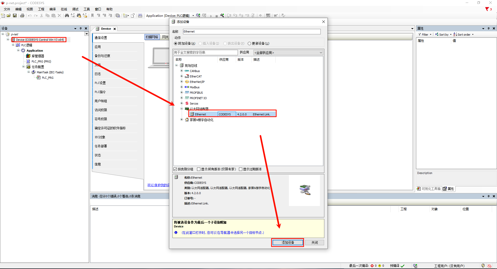

* PROFINET IO主站添加：右键左侧导航栏中的Ethernet，选择PN-Controller

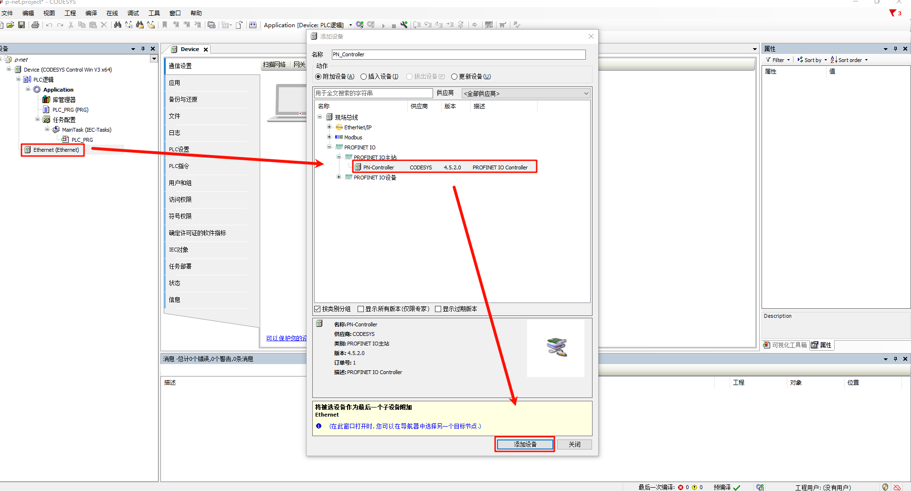

* PROFINET IO从站添加：右键左侧导航栏中的 PN-Controller，选择 P-Net-multiple-module sample app

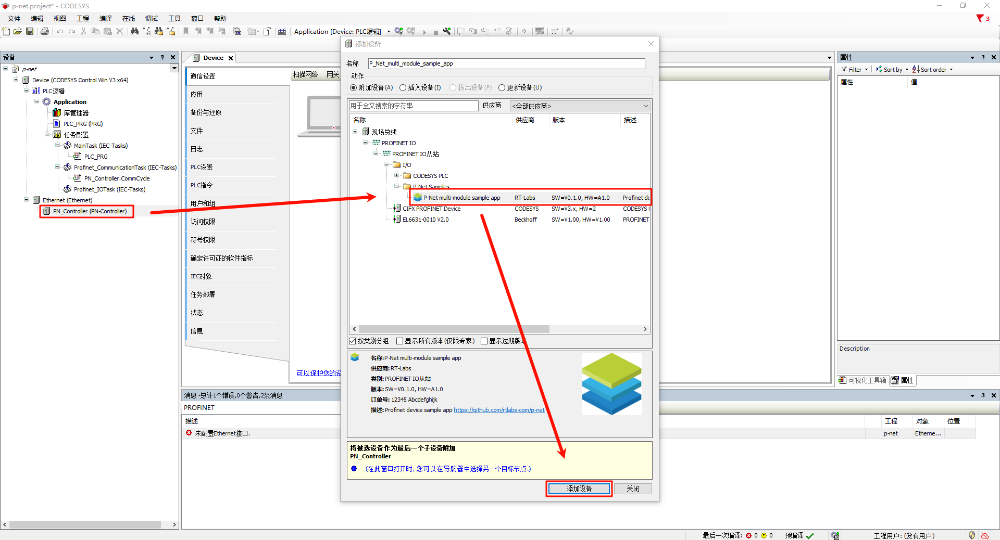

### 4.5 任务响应

* Main Tasks 配置：左侧导航栏选择 Application -> 任务配置 -> 双击MainTask(IEC-Tasks)，优先级设置为1，类型选择循环，周期选择 4ms；


* Profinet_CommunicationTask 配置：双击 Profinet_CommunicationTask(IEC-Tasks)，优先级设置为14，类型选择循环，周期设置为 10ms。


### 4.6 网络配置

* Ethernet 配置：双击左侧导航栏中的Ethernet(Ethernet) -> 通用，修改网络接口为连接到开发板的以太网端口；


* PN_Controller 配置：双击左侧导航栏 PN_Controller(PN-Controller) -> 通用，并正确修改默认从站IP参数的区间，根据提示修改即可。
* P-Net 从站网络配置：双击左侧导航栏 P-Net-multiple-module sample app -> 通用， 修改IP参数为开发板IP。


### 4.7 工程编译并启动调试

* step1：工程上方导航栏选择 编译-> 生成代码
* step2：选择 在线 -> 登录
* step3：点击 调试 -> 启动

此时就可以看到 PN 主站已经上线成功

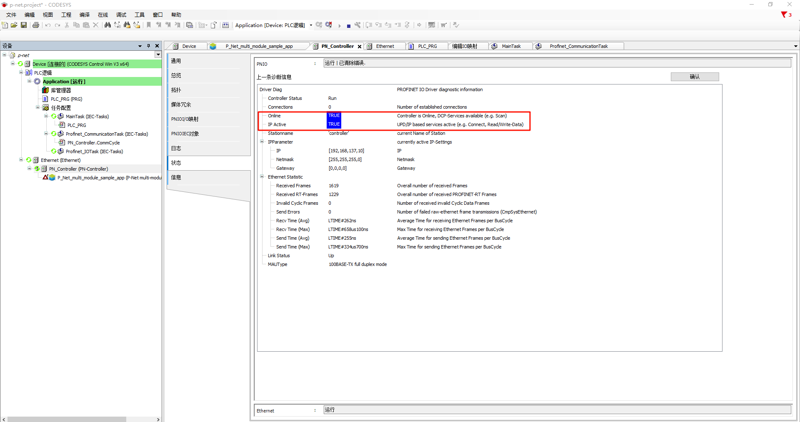

## 5.profinet 从站应用启动

开发板端上电后，一旦检测到网卡 link up，则会自动启动 PN 从站：


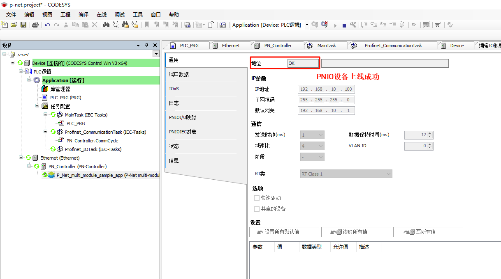

## 6.PN协议栈运行demo

> 这里我们分别使用 CODESYS 和 PRONETA 两款软件来测试 PN 的主从站交互及网络拓扑状态。

### 6.1 LED闪烁

回到 CODESYS 软件，左侧导航栏选择 PN_Controller，右键点击扫描设备，单击设备名后点击闪烁LED：

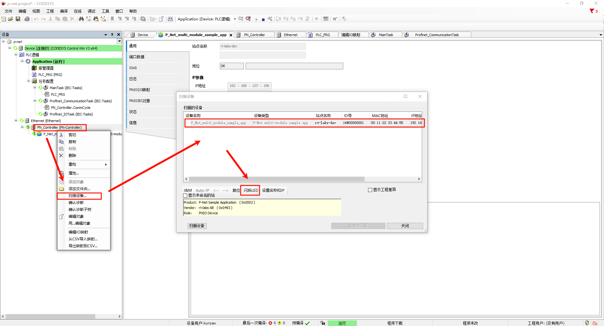

此时的开发板端（PN从站IO）可以看到日志输出，并伴随板载User LED闪烁：


### 6.2 从站 I&M 数据修改

依然是扫描设备界面，我们点击左下角的 I&M，修改信息并写入 I&M：


同时 PNIO 会更新从站配置信息：


我们再次点击 I&M，即可发现 I&M 修改成功！

### 6.3 PLC编程及PNIO控制

首先我们点击左侧面板的Device->PLC逻辑->Application->PLC_PRG(PRG)，使用ST语言编程，编写变量及程序代码：

* 变量定义：这些变量定义了按钮的输入状态（in_pin_button_LED），LED 的输出状态（out_pin_LED）以及控制 LED 是否闪烁的状态变量（flashing）。振荡器状态（oscillator_state）和振荡器周期计数器（oscillator_cycles）用来实现定时闪烁效果。

```st
PROGRAM PLC_PRG
VAR
    in_pin_button_LED: BOOL;
    out_pin_LED: BOOL;
    in_pin_button_LED_previous: BOOL;
    flashing: BOOL := TRUE;
    oscillator_state: BOOL := FALSE;
    oscillator_cycles: UINT := 0;
END_VAR
```

* 程序定义：
  1. 首先在每次循环中，oscillator_cycles 增加 1。当计数器超过 200 时，重置计数器并切换 oscillator_state 的状态（TRUE 或 FALSE），实现周期性变化；
  1. 如果按钮被按下（in_pin_button_LED 为 TRUE），并且在上一周期按钮状态是 FALSE，则切换 flashing 状态。即每次按钮按下时，切换 LED 是否闪烁的状态。
  1. 如果 flashing 为 TRUE，则 LED 会根据振荡器状态 (oscillator_state) 闪烁；如果 flashing 为 FALSE，LED 直接关闭。
  1. 在每次循环结束时，将当前按钮的状态保存在 in_pin_button_LED_previous 中，以便在下次判断按钮按下的事件。

```st
oscillator_cycles := oscillator_cycles + 1;
IF oscillator_cycles > 200 THEN 
    oscillator_cycles := 0;
    oscillator_state := NOT oscillator_state;
END_IF
IF in_pin_button_LED = TRUE THEN 
    IF in_pin_button_LED_previous = FALSE THEN 
        flashing := NOT flashing; 
    END_IF
    out_pin_LED := TRUE;
ELSIF flashing = TRUE THEN 
    out_pin_LED := oscillator_state;
ELSE 
    out_pin_LED := FALSE;
END_IF
in_pin_button_LED_previous := in_pin_button_LED;
```

工程中的配置位置如下图所示：


接下来我们还需要添加一个内置的IO模块，右键点击P_Net_multi_module_sample_app然后添加一个IO模块（DIO 8xLogicLevel），如下图所示：

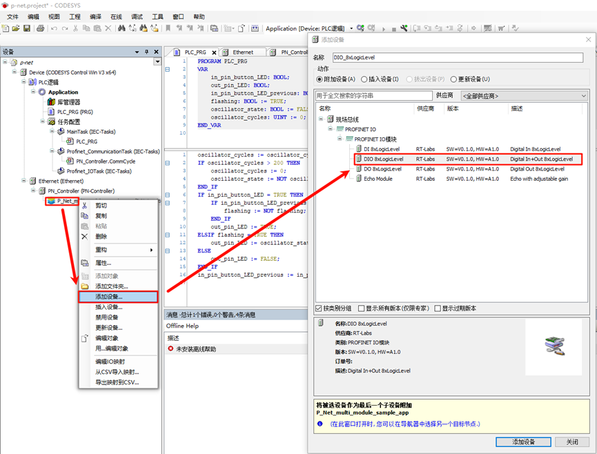

接下来双击DIO_8xLogicLevel节点，选择PNIO Module I/O映射，编辑Input Bit 7和Output Bit 7并绑定PLC变量：


接着我们点击上方导航栏的编译->生成代码，然后选择在线->登录，运行查看现象；


接下来回到CODESYS，再次双击Device->PLC逻辑->Application下的PLC_PRG(PRG)，此时便可动态观察程序运行状态，例如我们按住etherkit开发板上的KEY0，可以发现in_pin_button_LED及in_pin_button_LED_previous这两个变量值为FALSE，此时再松开KEY0，可以发现flashing值反转一次。


### 6.4 PN网络拓扑

> PRONETA 介绍：PRONETA Basic 是一款简易工具，用于快速分析和组态 PROFINET 网络，且可对 ET 200 分布式 IO 系统和其它组件进行简单测试。

#### 6.4.1 安装GSDML文件

我们打开下载的 PRONETA 软件，添加 GSDML文件：

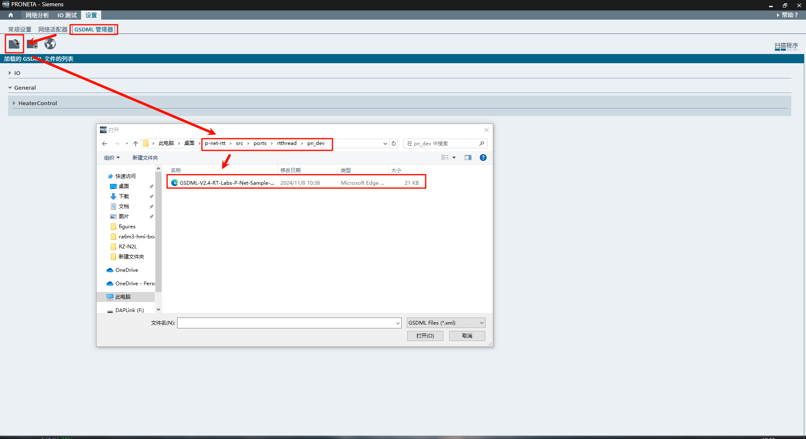

安装成功后可以看到状态信息：


#### 6.4.2 选择网络适配器

点击 设置 -> 网络适配器，选择 PN 对应的以太网口：

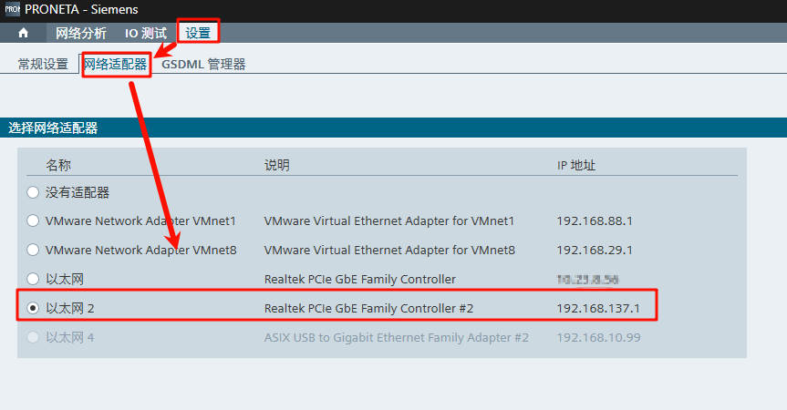

#### 6.4.3 在线组网状态查看

选择左上角导航栏 网络分析-> 在线，点击刷新，稍等片刻便可看到 PN组网状态，同时在右侧栏可以查看具体的PNIO信息，由于我们刚刚在CODESYS中修改了PNIO的信息，在这里也可以看到更新之后的信息

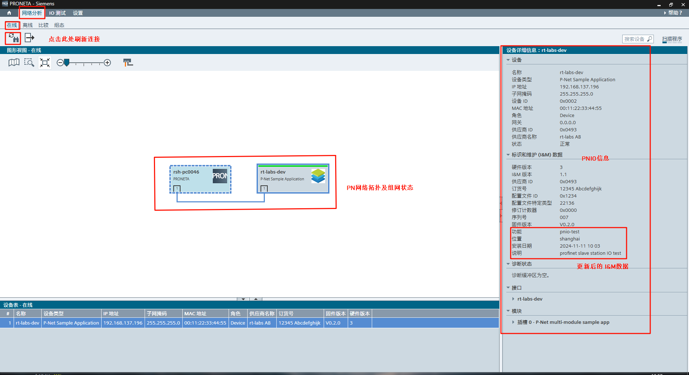

由于 pnet默认仅支持一个AR，所以我们需要关闭CODESYS的主站的网关设备及软PLC设备：


然后刷新设备后，右键 rt-labs-dev，测试 LED 及I&M数据修改：

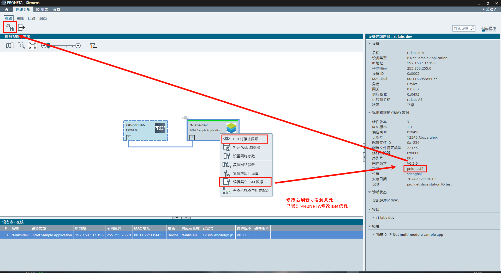